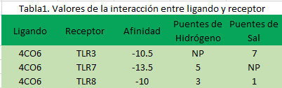

## Antígenos y receptores, ¿Cuáles son más compatibles?
###### Ana Guadalupe Méndez Hernández, Angel Ramirez Angeles, Ana Rosa de la Cruz Nicolás, Andrea Melissa Mollineda Oregón 

Nuestro proyecto consiste en hacer una investigación de las proteínas pertenecientes a un virus,  en este caso el virus de Nipah, con el fin de analizar la unión que puede tener con algunos receptores tipo TOLL, mediante varios servidores e interpretar  la información que nos generan

<html>
<head>
<meta name="viewport" content="width=device-width, initial-scale=1">

</head>
<body>

    <figcaption>Fig.1 - Los murciélagos sobrevuelan el mercado de Battambang, Camboya orinando y defecando en cualquier sitio.</figcaption>
</body>
</html>

## Introducción

El virus de Nipah es un virus zoonótico ya que es transmitido principalmente de animales a personas aunque también  de un individuo a otro y mediante alimentos contaminados. Esta enfermedad infecciosa es reconocida por primera vez en 1999 en Malasia durante un brote entre criadores de cerdos. El virus Nipah es un miembro del género Henipavirus de la familia Paramyxoviridae. Este género incluye al virus Hendra, con el que está estrechamente relacionado.

La infección por este virus es una enfermedad emergente y endémica en el sureste de Asia, en Bangladesh se reconoció por primera vez en el año 2001, el país ha sufrido brotes anuales desde entonces al igual que al este de la India. Otras regiones están en riesgo de infección por el virus de Nipah ya que se han encontrado pruebas serológicas de su presencia en el reservorio natural de especies de murciélagos del género Pteropus, entre otras especies de murciélagos ubicados en otros países como Camboya, Filipinas, Ghana, Indonesia, Madagascar y Tailandia.

Una de las principales sospechas de este acontecimiento son los incendios forestales y la sequía, ya que estos factores provocaron el desalojo del hábitat natural de los murciélagos provocando su migración a zonas cultivadoras de frutos, mismas zonas en las que se encuentran las granjas de cerdos.  
La tasa de letalidad del virus se estima entre un 40% y un 75%, dependiendo del brote. En la actualidad no existen medicamentos ni vacunas para la infección por el virus de Nipah, por lo que se encuentra dentro de las enfermedades prioritarias del plan de investigación y desarrollo de la OMS (World Health Organization, 2011

**Receptores tipo TOLL (TLR's)**

Los receptores tipo toll (TLRs)  son sensores de reconocimiento de membrana evolutivamente conservados, propios de la inmunidad innata que reconocen características presentes en la superficie de patógenos o que son liberados por tejido necrótico. Los TLRs se unen a través de sus dominios, que contienen repeticiones ricas en leucina (RRL) a los PMAM, y de esa manera las células desencadenan respuestas inmunitarias, entre ellas acciones inflamatorias y antivirales a través de vías de señalización derivadas del receptor intracelular (Durán A., 2014)

<html>
<head>
<meta name="viewport" content="width=device-width, initial-scale=1">

</head>
<body>

    <figcaption>Fig.2 - Receptores tipo TOLL (TLRs).</figcaption>
</body>
</html>

**Las proteínas del virus de Nipah**

Se han estudiado proteínas como la 4CO6 que es una estructura cristalina del complejo nucleoproteína-fosfoproteína libre de ARN del virus Nipah y la 6EB9 estructura cristalina del dominio de multimerización de fosfoproteínas del virus Nipah proporcionando nuevos conocimientos para la obtención de posibles fármacos contra el virus. Es por ello que en este trabajo se tiene como principal objetivo encontrar ciertos antígenos que sean reconocidos con receptores tipo toll (TLRs).

**4CO6: Estructura cristalina del complejo glucleoproteína-fosfoproteína libre de ARN del virus Nipah**
- DOI:  10.2210 / pdb4CO6 / db
- Clasificación:  CHAPERONE
- Organismo (s):  Nipah henipavirus
- Sistema de expresión:  Escherichia coli BL21 (DE3) 
- Mutación (es):  No  

**Estructura tridimensional de la proteína 4CO6 del virus de Nipah**

**Proteína 6EB9: Estructura cristalina del dominio de multimerización de fosfoproteínas del virus Nipah Delta 542-544**
- DOI:  10.2210 / pdb6EB9 / pdb
- Clasificación:  PROTEÍNA VIRAL
- Organismo (s):  Nipah henipavirus
- Sistema de expresión:  Escherichia coli
- Mutación (es):  No

**Estructura tridimensional de la proteína chaperona 4CO6 del virus del Nipah**

## Metodología

1.   Se realizó una investigación a cerca de las proteínas pertenecientes al virus de Nipah, estas podrían ser proteínas de la cubierta del virus o de su interior, la finalidad de esto es utilizarlas como posibles antígeno y mediante una base de datos y varios software’s comprobar su afinidad con diferentes receptores tipo TOLL.

2.   Una vez seleccionadas las proteínas propias del virus de Nipah se tomaron en cuenta ciertas características como su estructura, función y ubicación, para posteriormente emparejarlas con un receptor de tipo TOLL. Las estructuras tridimensionales de las proteínas fueron obtenidas de la página de PDB (Protein Data Bank)

3.   Para tener una mejor visualización de la estructura de las proteínas y llevar a cabo un análisis más detallado se utilizó el programa “UCSF Chimera”, cada proteína tiene un código de identificación  PDB (obtenido en la página Protein Data Bank) que se puede ingresar y gracias a la base de datos con la que cuenta el programa se genera la imagen tridimensional de la proteína, las funciones con las que cuenta Chimera van desde una visualización interactiva de la estructura, su análisis molecular y datos relacionados como mapas de densidad, ensamblajes moleculares, secuencias de aminoácidos, acoplamientos y trayectorias.

4.   Una vez que se tuvo la proteína en el programa Chimera, se eliminaron todos los residuos que rodeaban a la estructura mediante las funciones del programa, se seleccionan las cadenas específicas de los residuos y se borran, dejando únicamente la proteína de interés

5.   Se le asignó un nombre a cada cadena para que sirviera como identificador para el software que se utilizaría más adelante y se coloreó la estructura del antígeno. Se realizó el mismo procedimiento para los receptores de tipo TOLL, se limpian de todos los residuos y también se le asignan un nombre a cada cadena diferente de los antígenos.

6.   Cada estructura se guardó como un documento .pdb y con el nombre que identificará a cada molécula. Se llevó a cabo el docking molecular con ayuda del servidor web “HDOCK”, la página utiliza un algoritmo de acoplamiento híbrido de modelado basado en plantillas y acoplamiento gratuito. 

7. Una vez que la página generó una imagen del acoplamiento entre la proteína del virus (antígeno) y el receptor tipo TOLL, se descargó el modelo considerando la predicción con mayor afinidad. En la parte inferior de la página de HDOCK se muestra una tabla con los diversos modelos posibles, cada uno tiene los datos aproximados de la energía de atraque, donde menor sea el número más posibilidad hay de unión

8. Para tener un dato más preciso de la afinidad entre las moléculas del modelo generado por HDOCK se utilizó Prodigy Webserver (PROtein binDIng enerGY prediction) que genera una predicción de la afinidad de unión en complejos biológicos, así como la identificación de interfaces biológicas a partir de una cristalografía.

9. Se analizaron las uniones entre las moléculas mediante la página de PDBsum, este servidor web proporciona información estructural más detallada sobre las proteínas del Protein Data Bank, los análisis que el algoritmo genera se basan principalmente en imágenes e incluyen estructura secundaria de proteínas, interacciones proteína-ligando, que es lo que se busca en el proyecto, también trabaja con complejos proteína-DNA y análisis PROCHECK de calidad estructura, entre otras funciones

10.  Finalmente, se interpretaron los resultados obtenidos de cada uno de los servidores a los que se introdujo los modelos de las proteínas con los receptores 

**Diagrama de flujo  de la metodología empleada en el proyecto**

### Resultados
A continuación, les mostraremos los resultados del docking molecular que llevamos a cabo con cada una de las proteínas y con los receptores que seleccionamos.

Para la proteína chaperona 4CO6, que está presente en el interior del virus, se decidió usar receptores tipo toll (TLR's) internos, como  el TLR3, TLR7 y TLR8.

En la Tabla 1. Se puede apreciar la afinidad de cada interacción entre ligando-receptor, si hay o no hay presencia de puentes de hridógeno así como puentes salinos. El receptor TLR8 al interaccionar con la proteína 4CO6 no dio una afinidad tan alta como las otras interacciones ligando-receptor, pero tuvo presencia de puentes de hidrógeno y puentes de sal, por lo que es de gran interes estudiar a estas moléculas en trabajos posteriores.

**Modelo generado por HDOCK de la proteína 4CO6 con el receptor TLR7**

**Análisis de posibles uniones entre la proteína 4CO6 con el receptor TLR7 con sus  puntajes de docking**

**Energía de unión entre la proteína 4CO6 y el receptor TLR7**

Para la proteína 6EB9 se decidió usar con receptores tipo toll (TLR's) externos, ya que según estudios anteriores la proteina 6EB9 es de gran abundancia en el virus de Nipah, dando los siguientes resultados al interaccionar con los receptores TLR4 Y TLR5 que se aprecian en la Tabla 2. 

**Interacción entre la proteína 4CO6 y el receptor TLR3**

### Conclusiones

Existen diversas técnicas que nos ayudan a predecir las energías y modos de enlace entre ligandos y receptores, como es el docking molecular, esta técnica nos permitió ver la interacción entre antígeno y receptor, en este caso de una proteína perteneciente a un virus y un receptor de tipo toll (TLR) presente en algunas células del sistema inmune. El poder predecir la afinidad de la unión entre las moléculas puede ayudarnos a estudiar la respuesta que se genera dentro de nuestro organismo al estar en contacto con un agente patógeno.

### Bibliografía

1. World Health Organization. (2011). Nipah virus= Virus Nipah. Weekly Epidemiological Record= Relevé épidémiologique hebdomadaire, 86(41), 451-455.
Ejecutivo, C. (2018). Preparación y respuesta en materia de salud pública: labor de la OMS en emergencias sanitarias: informe del Director General (No. EB142/9). Organización Mundial de la Salud.
2. Ramphul, K., Mejias, S. G., Agumadu, V. C., Sombans, S., Sonaye, R., & Lohana, P. (2018). The killer virus called Nipah: a review. Cureus, 10(8).
3. Bonaparte, M. I., Dimitrov, A. S., Bossart, K. N., Crameri, G., Mungall, B. A., Bishop, K. A., ... & Broder, C. C. (2005). Ephrin-B2 ligand is a functional receptor for Hendra virus and Nipah virus. Proceedings of the National Academy of Sciences, 102(30), 10652-10657.
4. Durán, A., Álvarez-Mon, M., & Valero, N. (2014). Papel de los receptores tipo toll (TLRs) y receptores para dominios de oligomerización para la unión a nucleótidos (NLRs) en las infecciones virales. Investigación Clínica, 55(1), 61-81.

### Video

 <iframe width="560" height="315" src="https://www.youtube.com/embed/sD_B5b3sF38" title="YouTube video player" frameborder="0" allow="accelerometer; autoplay; clipboard-write; encrypted-media; gyroscope; picture-in-picture" allowfullscreen></iframe>
 
### Equipo

* Ana Guadalupe Méndez Hernández
* Angel Ramirez Angeles
* Ana Rosa de la Cruz Nicolás
* Andrea Melissa Mollineda Oregón 

